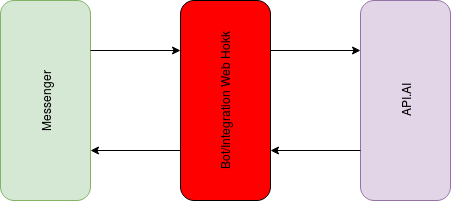

# apiai_messenger_integration
apiai messenger bot (Integration webhook)
  
  
Messenger api.ai integration is managed by webhook.We can write webhook in python either using flask or using bottle framework.This codes are the examples of how to do that. Webhook plays the role of the red box that can be observed in diagram above,
